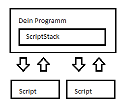
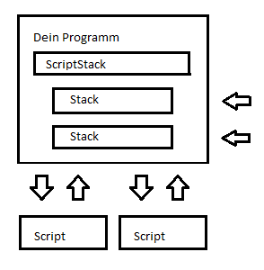
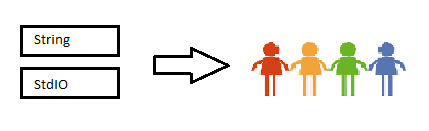

# ScriptStack

ScriptStack ist keine Scriptsprache im herkömmlichen Sinn sondern eine API mit der du deine eigene Scriptsprache erstellen kannst. 

Du kannst aber auch eine eigenen Stack schreiben und ScriptStack so mit speziell an deine Anforderungen abgestimmten Eigenschaften und Möglichkeiten erweitern.

Das kann z.B bei industrieller Software, Sensorik, Textverarbeitung mit speziellen Dateiformaten aber auch Spielen (z.B Unity) sehr nützlich sein. So kannst du deinen Code leicht wiederverwenden, mehrere Stacks aufeinander aufbauend entwickeln und deine Konstruktionen mit anderen teilen.

Mehr Infos im [Wiki](https://github.com/zarat/Scriptstack/wiki). 
